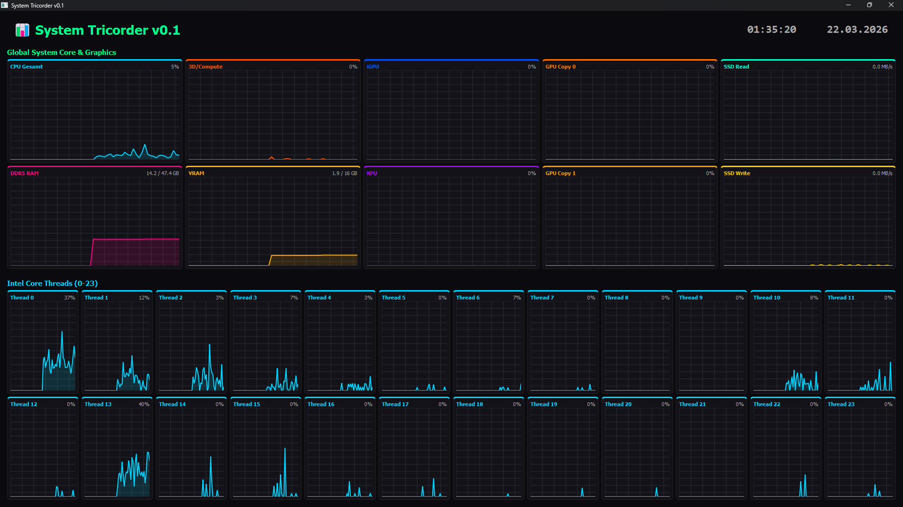

# 📊 System Tricorder

A sleek, high-performance hardware monitoring dashboard for Windows. Built with Python and PyQt5, it provides real-time system metrics with a dark-mode cyberpunk aesthetic at a smooth 20 FPS.




## ✨ Features

* **Smart CPU Topology:** Automatically analyzes your processor. Dynamically detects and visually separates Intel Performance (P-Cores) & Efficiency (E-Cores), as well as AMD Ryzen multi-die threads. Colors adapt automatically to your CPU brand.
* **Robust VRAM & RAM Detection:** Uses deep Windows Registry hooks and WMI to accurately read GPU VRAM (bypassing the notorious Windows 32-bit limit for modern >4GB GPUs) and dynamically detects DDR4/DDR5 RAM speeds.
* **Comprehensive Metrics:** Tracks CPU load, RAM usage, GPU (3D/Compute, Copy engines, VRAM), iGPU, NPU, and SSD Read/Write speeds in real-time.
* **Aesthetic UI:** A clean 2x5 global grid layout with dynamic color-coding, borderless window elements, and a dark-mode aesthetic.
* **Standalone Capability:** Can be easily compiled into a single `.exe` file so you can share it with friends who don't have Python installed.

## 🚀 Requirements

Make sure you have Python 3 installed. You will need the following Python packages to run the source code:

```bash
pip install PyQt5 psutil pywin32
```

## 🛠️ Usage

Simply run the python script from your terminal or double-click it (if `.py` files are associated with Python):

```bash
python system_tricorder.py
```

*Note: This tool uses Windows-specific APIs (WMI & Registry) to fetch accurate hardware data and is designed specifically for Windows 10 and 11.*

## 📦 Building an Executable (.exe)

If you want to run this without installing Python (or share it with others), you can compile it into a standalone executable using `pyinstaller`:

1. Install PyInstaller:

```bash
pip install pyinstaller
```

2. Build the executable:

```bash
pyinstaller --noconsole --onefile system_tricorder.py
```

You will find the compiled `system_tricorder.exe` inside the newly created `dist` folder.

## 🤝 Contributing

Feel free to open issues or submit pull requests if you have ideas for new features or hardware support improvements!