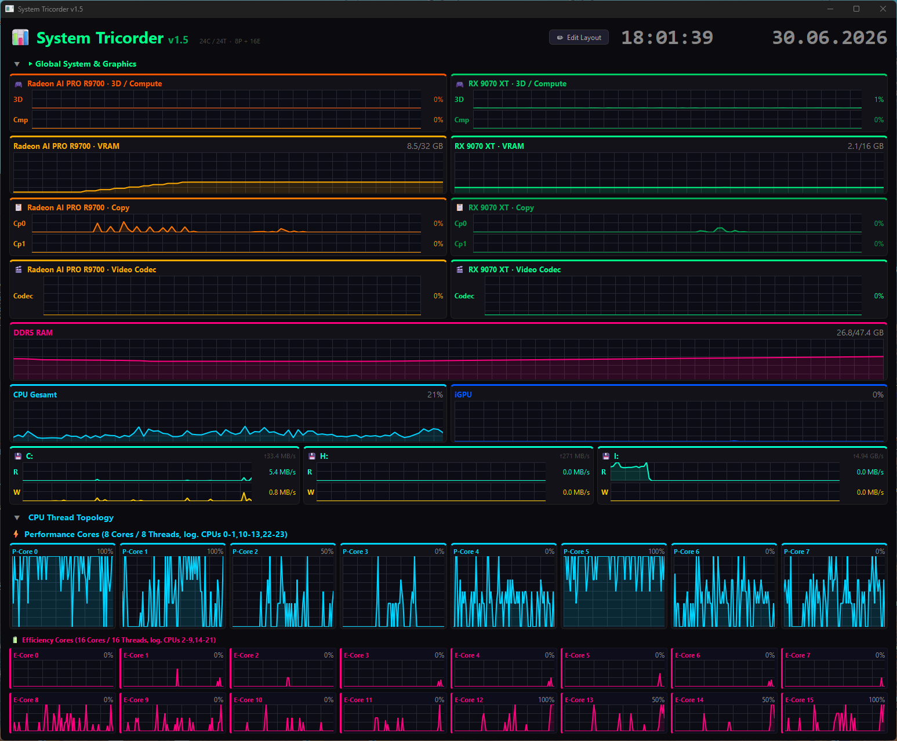

# 📊 System Tricorder

> A real-time hardware monitoring dashboard for Windows and Ubuntu/Linux — dark mode, 30 FPS, fully customisable free-form layout.


---

## 🖥️ Screenshots


---

## ✨ What it does

System Tricorder gives you a live, graph-based view of your entire system at a glance — CPU, RAM, GPU(s), NPU, iGPU, and per-drive disk I/O — all updating at 30 FPS in a clean dark-mode window.

Every aspect of the layout is yours to control: arrange tiles into any number of rows with any number of tiles per row, hide what you don't need, restore it later, collapse entire sections. Everything persists across restarts automatically.

---

## 🚀 Installation

```bash
git clone https://github.com/DaWasteh/System-Tricorder.git
cd system-tricorder
pip install PyQt6 psutil pywin32
python system_tricorder.py
```

> ℹ️ Windows uses WMI/Registry/PDH for hardware counters. Ubuntu/Linux uses psutil, lspci, DRM sysfs/fdinfo and optional NVML for GPU counters.

---

## 📦 Building an Executable (.exe)

```powershell
pip install pyinstaller
pyinstaller --noconsole --onefile --icon "assets\SystemTricorder.ico" --add-data "assets\SystemTricorder.png;assets" system_tricorder.py
```

The bundled executable and its running window use `assets/SystemTricorder.png`; the Windows `.exe` resource uses the generated `assets/SystemTricorder.ico`.

---

## 🎛️ Edit Mode — Customising your layout

Press **✏ Edit Layout** in the toolbar to enter edit mode. All tiles highlight with a yellow accent border and gain two overlay buttons.

Press **⬇ Update** to check GitHub for a newer version and install it via a fast-forward `git pull`. Your local layout/settings file (`~/.tricorder_layout.json`) is stored outside the repo and is not overwritten.

### Controls on each tile

| Button | Position | Action |
|--------|----------|--------|
| **×** | top-right | Hide the tile (moved to the hidden pool, not deleted) |
| **↵** | top-left | Toggle a row break before this tile — green = break active |

### Toolbar controls (visible in edit mode)

| Button | Action |
|--------|--------|
| **＋ Add Tile** | Opens a checklist of all hidden tiles so you can restore any of them |
| **‹ / ›** | Decrease / increase the minimum row height |
| **↺ Reset** | Restores the factory default layout and clears all row breaks |
| **✔ Fertig** | Leave edit mode — layout is saved automatically |

### Update control

| Button | Action |
|--------|--------|
| **⬇ Update** | Checks `DaWasteh/System-Tricorder` on GitHub and installs available updates without touching `~/.tricorder_layout.json` |

### Arranging tiles freely

The global grid has no fixed column count. Each row is independent and can hold any number of tiles. To build your own layout:

**Drag a tile onto another tile** — the yellow bar on the left or right edge of the target shows whether it will land before or after.

**Drag a tile onto the `── new row ──` line** that appears between rows — the tile is pulled out of its current row and placed as the first tile of a brand-new row at that position. This is how you create layouts like:

```
CPU  |  RAM
3D/Compute  |  Copy  |  VRAM
iGPU  |  NPU
SSD C:  |  SSD D:  |  SSD E:  |  HDD F:
```

**Drag a tile onto the `+` zone** at the right end of a row to append it to that row.

**Click ↵** on any tile to toggle a forced row break directly before it — useful for fine-tuning without drag operations. The button turns green when a break is active.

Any combination of row lengths is valid:

```
()
()()()()
()()
()
()
()()()
()()()()()()()
```

Your layout, including all row breaks, is saved to `~/.tricorder_layout.json` on every change.

---

## 📐 What's monitored

### Global Grid (all tiles freely arrangeable and hideable)

| Tile | What it shows | Source |
|------|--------------|--------|
| CPU Gesamt | Total CPU utilisation | psutil |
| DDR4 / DDR5 RAM | Used / total memory | psutil + WMI type detection |
| iGPU | Integrated GPU engine utilisation | WMI GPU counters |
| NPU | Neural Processing Unit utilisation | WMI GPU counters |
| GPU N · 3D / Compute | Two sparklines: rasterisation + compute/CUDA separately | WMI GPU counters |
| GPU N · Copy | Two sparklines: Copy Engine 0 + Copy Engine 1 | WMI GPU counters |
| GPU N · Video Codec | Video Codec Engine utilisation | WMI GPU counters |
| GPU N · VRAM | Used / total VRAM | WMI + Registry |
| Drive X | Two sparklines: Read MB/s + Write MB/s | psutil per-disk I/O |

### CPU Thread Topology (collapsible section)

| CPU Type | Display |
|----------|---------|
| Intel Hybrid (P+E cores) | Two separate responsive grids — P-Cores and E-Cores |
| Intel / AMD with HT / SMT | Paired columns: physical core + logical sibling always together |
| Single-thread cores | Uniform responsive grid |

Both sections (Global System & Graphics and CPU Thread Topology) can be collapsed by clicking their header. Freed space is redistributed to whatever remains visible.

---

## 💾 Per-Drive Tiles

Each physical drive gets its own tile with two stacked sparklines and an auto-scaling axis:

```
💾  C:/D:                         ↑ 623 MB/s
R  ──────────────────────────────  847.2 MB/s
W  ──────────────────────────────    0.1 MB/s
```

Values are shown in MB/s and automatically switch to GB/s for drives exceeding 1000 MB/s. Drive tiles are labelled with their Windows drive letters (`C:`, `D:`, `C:/D:` for multi-partition drives).

---

## 🗂️ Layout Config Format

`~/.tricorder_layout.json` stores your complete layout. The `__row__` sentinel marks row breaks.

```json
{
  "version": "0.8",
  "min_row_h": 130,
  "tile_order": [
    "cpu_total", "ram",
    "__row__",
    "gpu_0_3d", "gpu_0_copy", "gpu_0_codec", "gpu_0_vram",
    "__row__",
    "igpu", "npu",
    "__row__",
    "drive_PhysicalDrive0", "drive_PhysicalDrive1"
  ],
  "hidden_tiles": []
}
```

Delete the file to reset to factory defaults.

---

## 🗂️ Changelog

### v1.9

- **Update button** — new toolbar button checks GitHub for newer commits and installs them with a safe fast-forward `git pull`.
- **Settings stay local** — the updater never writes or resets `~/.tricorder_layout.json`, so layouts/window settings survive updates.
- **Idea credit** — thanks to [nextscript](https://github.com/nextscript) for the update-button idea.

### v1.8

- **Ubuntu/Linux GPU parity** — Linux now enumerates GPUs through DRM/sysfs with `lspci` fallback, so multiple AMD/NVIDIA dGPUs plus Intel iGPU are visible like on Windows.
- **nvtop-style Linux utilisation sources** — AMD uses `gpu_busy_percent` with DRM `fdinfo` fallback; Intel iGPU and engine tiles use DRM `fdinfo`; NVIDIA is matched through NVML by PCI bus id.
- **Linux drive tiles fixed** — Ubuntu no longer creates one tile per partition; tiles are filtered to whole physical disks and get compact labels like `C: Ubuntu` / `H: Zwischenspeicher`.
- **Windows behavior preserved** — Windows WMI/Registry/PDH code paths remain isolated and unchanged.

### v1.1

- **iGPU/NPU-Kacheln nur bei vorhandener Hardware** — iGPU- und NPU-Kacheln werden jetzt nur noch registriert, wenn die Hardware tatsächlich existiert. Reine Desktop-CPUs ohne iGPU/NPU (z.B. AMD Ryzen 5800X3D) zeigen diese Kacheln nicht mehr an — weder im Dashboard noch im „Add Tile"-Dialog. iGPU-Erkennung über WMI (`is_igpu`), NPU-Erkennung über `Win32_PnPEntity` (gezielte Gerätenamen wie „AI Boost", „NPU Compute", „IPU Device", „Hexagon"; bewusst **kein** nacktes `NPU`-Token, da `%NPU%` sonst jedes „Input Device" treffen würde)
- **Video Codec auf NVIDIA** — die Codec-Engine-Erkennung matcht jetzt zusätzlich `VideoDecode`/`VideoEncode`. AMD nutzt eine einzelne `VideoCodec`-Engine, NVIDIA (und Intel) splitten sie in getrennte Decode-/Encode-Engines — die Video-Codec-Kachel funktioniert damit auf allen Herstellern
- **Lint-Fix** — zwei Leerzeilen mit Whitespace (`W293`) im AMD-Erkennungsblock entfernt

### v1.0

- **Video Codec Engine tile** — neue GPU-Kachel für jede GPU zeigt die Video Codec Engine Auslastung (z.B. für Video-Encoding/Decoding)
- **AMD iGPU/NPU-Bugfix** — iGPU-Erkennung nun über PNPDeviceID VEN/DEV-Prüfung statt nur Namensmatch; Ryzen 5800X3D und ähnliche CPUs ohne iGPU zeigen keine falschen iGPU/NPU-Einträge mehr
- **Verbesserte NPU-Erkennung** — zu allgemeiner Marker `'npu'` durch spezifischere Patterns ersetzt (`'npu acceleration'`, `'intel npu'`), verhindert Falschmeldungen auf AMD-Systemen

### v0.8

- **PyQt5 → PyQt6 Migration** — vollständiger Wechsel von PyQt5 zu PyQt6; alle Inkompatibilitäten wurden behoben
  - `QtCore.Signal` → `QtCore.pyqtSignal`, `QtCore.Slot` → `QtCore.pyqtSlot`
  - `Qt.AlignHCenter` → `Qt.AlignmentFlag.AlignHCenter`, `Qt.Vertical` → `Qt.Orientation.Vertical`
  - `QPainter.setRenderHint(QPainter.Antialiasing)` beibehalten, aber alle Qt Namespace-Referenzen aktualisiert
  - `QCursor.pos()` → `QGuiApplication.cursorPosition()` für Cursor-Position
  - `QDesktopWidget.screenGeometry()` → `QGuiApplication.primaryScreen().geometry()`
  - `QFontMetrics.width()` → `QFontMetrics.horizontalAdvance()`
  - `QPainter.setPen(QColor(..., 0.3))` → Alpha-Kanal als `float` (0.0–1.0) statt `int` (0–255)
  - `QStyleOptionViewItem` Initialisierung angepasst
- **Config Format v0.8** — neue Versionsnummer im Layout-Config

### v0.7

- **30 FPS refresh rate** — monitor thread now runs at exactly 30 FPS (`1.0/30.0` instead of `0.033`), eliminating frame-rate drift
- **Sparkline repaint batching** — all sparkline `update()` calls are deferred to a single `batch_update()` at the end of each frame, reducing repaint events from ~1500/s to ~50/s
- **Cached gridlines pixmap** — sparkline background gridlines are rendered once to a `QPixmap` and cached per widget size, replacing ~19 500 `drawLine()` calls/s with a single `drawPixmap()` per widget
- **Drag ghost via alpha channel** — replaced the O(w×h) per-pixel alpha loop with `QPixmap.setAlphaChannel()`, making drag previews ~90× faster
- **Removed isinstance() checks** — `_update_ui()` no longer performs runtime type checks on tiles (types are known at registration time), reducing per-frame overhead
- **~25-35% lower CPU usage** — combined effect of all above optimisations

### v0.6

- **COM cleanup** — `pythoncom.CoUninitialize()` is now correctly called when the monitor thread exits, pairing every `CoInitialize()` and releasing the COM apartment cleanly
- **Logging** — a `logging` handler writes warnings and errors to `~/.tricorder.log`; WMI init failures and config I/O problems are now visible instead of silently discarded
- **Atomic config writes** — the layout config is written to a `.tmp` file first and then renamed into place, preventing a corrupt config if the process is killed mid-write
- **Config version migration warning** — loading a config from a different version now logs a warning to `~/.tricorder.log` instead of silently proceeding

### v0.5

- **Fully free row layout** — the global tile grid no longer has a fixed column count. Each row is independent and can hold any number of tiles. Any arrangement of row lengths is possible
- **`── new row ──` drop zones** — horizontal drop bars appear between every row in edit mode; dragging a tile onto one creates a brand-new row at that exact position
- **`+` row-end drop zones** — small drop targets at the right end of each row let you append tiles directly to a specific row
- **`↵` row-break button** — each tile gains a top-left button that toggles a forced row break before it; turns green when active
- **Default layout uses rows** — out of the box, tiles start on sensible separate rows (CPU/RAM, GPU engines, iGPU/NPU, drives) instead of one long line
- **E-Core grid balanced** — E-Cores now distribute evenly across rows (e.g. 8+8 instead of 12+4 for 16 E-Cores)
- **`‹ ›` buttons** now control row height instead of column count
- **Row breaks persist** across restarts via the `__row__` sentinel in the JSON config

### v0.4

- GPU 3D / Compute split — the 3D / Compute tile now shows two separate sparklines: 3D (rasterisation) and Cmp (Compute / CUDA / OpenCL), instead of a single combined value
- GPU Copy tile — Cp0 and Cp1 combined into one landscape tile (matching the Drive tile layout), instead of two separate metric tiles
- Free insert-before/after drag — tiles can be inserted before or after any other tile; left half of target = before, right half = after; yellow bar on tile edge shows live where it will land
- Dynamic column count — the global tile grid and CPU topology grid automatically adjust their column count to fit the window width
- Collapsible sections — both Global System & Graphics and CPU Thread Topology can be collapsed by clicking their header; freed space is correctly redistributed
- Responsive CPU grid — P-Core, E-Core and HT/SMT pairs reflow automatically on window resize; HT/SMT pairs always stay together in the same column
- Clock & date enlarged to 36 px

### v0.3

- Edit Mode — drag-to-reorder tiles, × to hide, ＋ to restore, ‹/› to adjust columns
- Per-drive tiles — each physical drive gets one landscape tile with dual Read/Write sparklines and auto-scaling MB/s axis (auto-switches to GB/s for fast NVMe)
- Layout persistence — order, hidden tiles, and column count saved to `~/.tricorder_layout.json`
- Collapsible CPU section — click the ▼ header to collapse/expand the thread topology grid
- WMI drive-letter mapping — tiles show `C:`, `D:` etc. instead of `PhysicalDrive0`

### v0.2

- Multi-GPU support (up to 4), each with its own colour-coded row
- Intel P/E Core visual separation — different box design per core type
- HT / AMD SMT pairs visualised as aligned columns
- Auto-detection of RAM type (DDR4/DDR5) via WMI
- Auto-detection of multi-socket systems
- Registry-based VRAM detection (avoids the 4 GB WMI cap)

### v0.1 *(initial release)*

- Basic 2×5 global metrics grid, per-thread CPU graphs, single GPU, dark mode 20 FPS

---

## 🙏 Thanks

Thanks to [nextscript](https://github.com/nextscript) for the update-button idea.

---

## 📄 License

MIT — do whatever you want with it.
