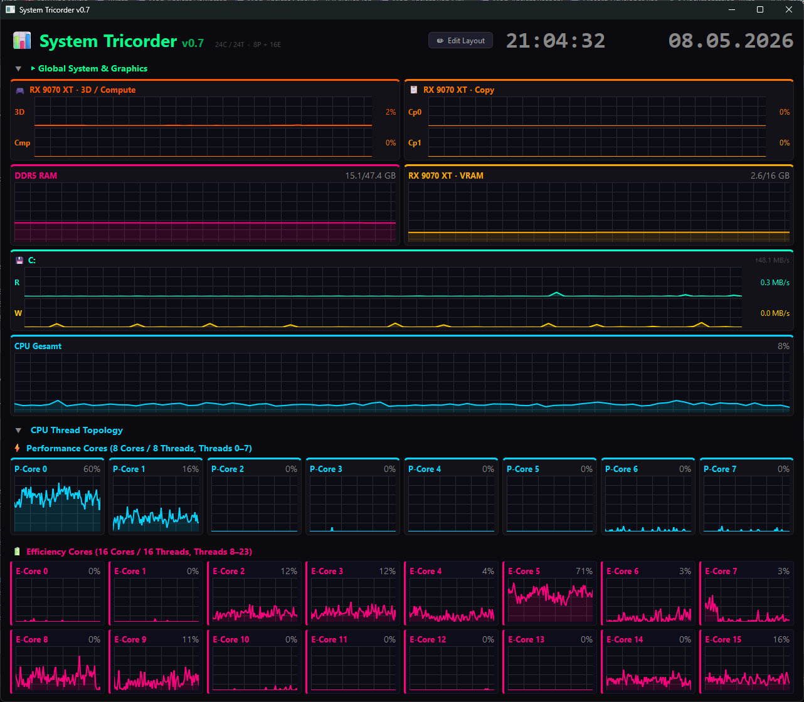

# 📊 System Tricorder

> A real-time hardware monitoring dashboard for Windows, macOS, and Linux — Light-/Darkmode, 30 FPS, fully customisable free-form layout.


---

## 🖥️ Screenshots



---

## ✨ What it does

System Tricorder gives you a live, graph-based view of your entire system at a glance — CPU, RAM, GPU(s), iGPU, package/board power, and per-drive disk I/O — all updating at 30 FPS in a clean Light- or Darkmode window.

Every aspect of the layout is yours to control: arrange tiles into any number of rows with any number of tiles per row, choose an individual colour for every tile, hide what you don't need, restore it later, and collapse entire sections. Everything persists across restarts automatically.

---

## 🚀 Installation

The [GitHub Releases](https://github.com/DaWasteh/System-Tricorder/releases) contain native packages for Windows, macOS, Ubuntu, Fedora, Arch Linux, Linux Mint, CachyOS, Kali Linux, and Debian. Extract `.tar.gz` packages before starting `SystemTricorder`.

To run from source:

```bash
git clone https://github.com/DaWasteh/System-Tricorder.git
cd System-Tricorder
python3 -m venv .venv
# Windows PowerShell: .venv\Scripts\Activate.ps1
# macOS/Linux:       source .venv/bin/activate
python -m pip install -r requirements.txt
python system_tricorder.py
```

Linux users can alternatively run `./start_linux.sh`. On macOS, install Python with Homebrew (`brew install python`) if the system Python has no working Qt support. Unsigned macOS downloads may require **right-click → Open** once.

> ℹ️ Windows uses WMI/Registry only for one-shot inventory, PDH for live WDDM/VRAM/CPU-package counters, AMD ADLX for Radeon load/board power, and NVML for NVIDIA. Linux uses psutil, lspci, DRM sysfs/fdinfo, powercap/hwmon and optional NVML. macOS currently provides portable CPU, RAM, and disk metrics through psutil; platform-specific GPU/power metrics are not yet available.

---

## 📦 Building a Native Package

```bash
python -m pip install -r requirements.txt pyinstaller
python .github/scripts/build_release.py --slug local
```

The package is written to `release/`. The bundled application uses `assets/SystemTricorder.png`; Windows additionally uses `assets/SystemTricorder.ico` as the executable resource.

---

## 🎛️ Edit Mode — Customising your layout

Press **✏ Edit Layout** in the toolbar to enter edit mode. All tiles highlight with a yellow accent border and gain two overlay buttons. **Right-click any tile** to choose its own colour from a spectrum with explicit RGB and HEX input, or restore its factory colour.

Press **⬇ Update** to install the newest GitHub version. Git checkouts continue to use a safe fast-forward pull; a standalone Windows EXE downloads and verifies the matching release asset before replacing itself; a standalone Python copy updates its script, requirements, and runtime PNG from the immutable release tag. Your local layout/settings file (`~/.tricorder_layout.json`) is stored outside every installation and is never overwritten.

> **One-time v2.7.5 bootstrap note:** standalone EXEs up to v2.7.4 still contain the old Git-checkout-only updater. Download v2.7.5 once from GitHub Releases and replace the old EXE manually. Starting with v2.7.5, future standalone EXE updates work directly through **⬇ Update**.

### Controls on each tile

| Button | Position | Action |
|--------|----------|--------|
| **×** | top-right | Hide the tile (moved to the hidden pool, not deleted) |
| **↵** | top-left | Toggle a row break before this tile — green = break active |
| **Right-click** | anywhere on tile | Open colour actions; choose via spectrum/RGB/HEX or reset to the factory colour |

### Toolbar controls (visible in edit mode)

| Button | Action |
|--------|--------|
| **＋ Add Tile** | Opens a checklist of all hidden tiles so you can restore any of them |
| **‹ / ›** | Decrease / increase the minimum row height |
| **↺ Reset** | Restores the factory tile order, row breaks, visibility, and row height |
| **✔ Fertig** | Leave edit mode — layout is saved automatically |

The always-visible **Darkmode / Lightmode** dropdown switches the complete dashboard theme immediately and remembers the selection. At narrower window widths the date first moves below the time and then disappears, while the clock itself remains visible.

### Update control

| Installation | **⬇ Update** behaviour |
|--------------|-------------------------|
| Git checkout | Compares the active branch with GitHub and uses `git pull --ff-only --autostash` |
| Standalone Windows EXE | Downloads the exact `windows-x86_64` release, verifies size, SHA-256, PE version and an isolated frozen self-test, then replaces/restarts with rollback protection |
| Standalone Python | Downloads only `system_tricorder.py`, `requirements.txt`, and the runtime PNG from the latest stable tag; verifies Git blob IDs and installs all files atomically |

All modes leave `~/.tricorder_layout.json` untouched. If standalone Python receives changed requirements, the app reports the exact `python -m pip install -r requirements.txt` command instead of silently modifying the environment.

### Arranging tiles freely

The global grid has no fixed column count. Each row is independent and can hold any number of tiles. To build your own layout:

**Drag a tile onto another tile** — the yellow bar on the left or right edge of the target shows whether it will land before or after.

**Drag a tile onto the `── new row ──` line** that appears between rows — the tile is pulled out of its current row and placed as the first tile of a brand-new row at that position. This is how you create layouts like:

```
CPU  |  RAM  |  CPU Watt
GPU  |  3D/Compute  |  Copy  |  VRAM  |  GPU Watt
iGPU
SSD C:  |  SSD D:  |  SSD E:  |  HDD F:
```

**Drag a tile onto the `+` zone** at the right end of a row to append it to that row.

**Click ↵** on any tile to toggle a forced row break directly before it — useful for fine-tuning without drag operations. The button turns green when a break is active.

Any combination of row lengths is valid:

```
()
()()()()
()()
()
()
()()()
()()()()()()()
```

Your layout, including all row breaks, is saved to `~/.tricorder_layout.json` on every change.

---

## 📐 What's monitored

### Global Grid (all tiles freely arrangeable and hideable)

| Tile | What it shows | Source |
|------|--------------|--------|
| CPU Gesamt | Total CPU utilisation | psutil |
| CPU · Leistungsaufnahme | CPU package/socket power in watts; AMD core-power fallback | Windows Energy Meter/RAPL; Linux powercap |
| DDR4 / DDR5 RAM | Used / total memory | psutil + WMI type detection |
| iGPU | Integrated GPU engine utilisation | Windows PDH; Linux DRM/sysfs |
| GPU N · GPU | Driver-native overall utilisation | AMD ADLX / NVML / DRM |
| GPU N · 3D / Compute | Separate rasterisation and compute queue sparklines | Windows PDH; Linux DRM fdinfo |
| GPU N · Copy | Two sparklines: Copy Engine 0 + Copy Engine 1 | Windows PDH; Linux DRM fdinfo |
| GPU N · Video Codec | Video Codec Engine utilisation | Windows PDH; Linux DRM fdinfo / NVML |
| GPU N · VRAM | Used / total VRAM | ADLX/NVML or native PDH/sysfs |
| GPU N · Leistungsaufnahme | Board power where available; GPU-chip power fallback | AMD ADLX; NVIDIA NVML; Linux hwmon |
| Drive X | Two sparklines: Read MB/s + Write MB/s | psutil per-disk I/O |

### CPU Thread Topology (collapsible section)

| CPU Type | Display |
|----------|---------|
| Intel Hybrid (P+E cores) | Two separate responsive grids — P-Cores and E-Cores |
| Intel / AMD with HT / SMT | Paired columns: physical core + logical sibling always together |
| Single-thread cores | Uniform responsive grid |

Both sections (Global System & Graphics and CPU Thread Topology) can be collapsed by clicking their header. Freed space is redistributed to whatever remains visible.

---

## 💾 Per-Drive Tiles

Each physical drive gets its own tile with two stacked sparklines and an auto-scaling axis:

```
💾  C:/D:                         ↑ 623 MB/s
R  ──────────────────────────────  847.2 MB/s
W  ──────────────────────────────    0.1 MB/s
```

Values are shown in MB/s and automatically switch to GB/s for drives exceeding 1000 MB/s. Drive tiles are labelled with their Windows drive letters (`C:`, `D:`, `C:/D:` for multi-partition drives).

---

## 🗂️ Layout Config Format

`~/.tricorder_layout.json` stores your complete layout. The `__row__` sentinel marks row breaks.

```json
{
  "version": "1.0",
  "theme": "dark",
  "min_row_h": 75,
  "tile_order": [
    "cpu_total", "ram", "cpu_power",
    "__row__",
    "gpu_0_total", "gpu_0_3d", "gpu_0_copy", "gpu_0_codec", "gpu_0_vram", "gpu_0_power",
    "__row__",
    "igpu",
    "__row__",
    "drive_PhysicalDrive0", "drive_PhysicalDrive1"
  ],
  "hidden_tiles": [],
  "tile_colors": {
    "cpu_total": "#8a5cff",
    "gpu_0_total": "#ff3366",
    "drive_PhysicalDrive1": "#00aaff"
  }
}
```

Use **Edit Layout → Reset** for the factory tile layout. Deleting the file additionally discards the saved window placement.

---

## 🗂️ Changelog

### v2.7.6

- **Individuelle Farben pro Kachel** — im Edit-Modus öffnet ein Rechtsklick auf CPU-, RAM-, GPU-, iGPU-, Watt- oder Laufwerkskacheln ein Farbspektrum mit RGB- und HEX-Eingabe; jede Kachel kann separat auf ihre Standardfarbe zurückgesetzt werden
- **Farben dauerhaft und hardwarefest gespeichert** — `tile_colors` liegt zusammen mit dem Layout außerhalb der Installation; Einstellungen für zeitweise getrennte GPUs oder SSDs bleiben bei späteren Layoutänderungen erhalten
- **Lightmode-/Darkmode-Dropdown** — das Farbschema lässt sich jederzeit direkt in der Kopfzeile wechseln und wird über Neustarts hinweg gespeichert; Panels, Graphen, Raster, Dialoge, Edit-Zonen und der native Windows-Titelbalken wechseln gemeinsam
- **Responsive Uhr mit Datum** — bei mittlerer Fensterbreite rutscht das Datum unter die Uhrzeit, bei kompakten Fenstern verschwindet nur das Datum und die Uhr bleibt sichtbar
- **Regressionstests erweitert** — Farbnormalisierung, RGB/HEX-Dialog, alle Kacheltypen, Reset, persistente und dormant Hardwarefarben, driftfreier Themewechsel, Graph-Cache sowie alle drei Datumszustände werden automatisiert geprüft
- **Windows-Build 2.7.6.0** — Onefile-EXE, Dateimetadaten, Frozen-Self-Test und Release-Artefakt wurden für v2.7.6 aktualisiert

### v2.7.5

- **Update-Button funktioniert für heruntergeladene Windows-EXEs** — ein lokaler Git-Checkout ist nicht mehr erforderlich; das neueste stabile GitHub-Release wird im Hintergrund geladen und die laufende EXE nach dem Schließen automatisch ersetzt und neu gestartet
- **Mehrstufig verifizierter EXE-Download** — nur das exakte `SystemTricorder-windows-x86_64.exe`-Asset des festen Repositories wird akzeptiert; Größe, GitHub-SHA-256, PE-Dateiversion und ein isolierter Frozen-Self-Test müssen vor der Installation erfolgreich sein
- **Rollbackfähiger Windows-Austausch** — ein separater Helper wartet auf die Freigabe der laufenden Datei, staged die neue EXE im Zielordner, behält die vorherige Version bis zum erfolgreichen Start als `.previous` und stellt sie bei Übergabefehlern wieder her
- **Standalone-Python ohne Git aktualisierbar** — Script, `requirements.txt` und Runtime-PNG kommen vom unveränderlichen Release-Tag, werden gegen ihre Git-Blob-IDs geprüft und als gemeinsame Transaktion mit Rollback sowie Erhalt bestehender Dateirechte installiert
- **Bestehende Git-Installationen unverändert unterstützt** — Branch-Vergleich, `--ff-only --autostash` und der automatische Windows-Rebuild für Checkout-EXEs bleiben erhalten; fremde Parent-Repositories werden nicht mehr versehentlich als Tricorder-Checkout akzeptiert
- **Netzwerk- und Regression-Härtung** — feste HTTPS-Host-/Pfadregeln, Größenlimits, Retry bei transienten Verbindungsabbrüchen und neue Tests für Hashfehler, unsichere URLs/Pfade, atomaren Rollback, Backup-Cleanup und POSIX-Dateimodi
- **Windows-Build 2.7.5.0** — lokale Onefile-EXE und Release-Metadaten wurden aktualisiert; Source-/Frozen-Self-Test sowie die vollständige plattformübergreifende CI sichern das Release ab

### v2.7.4

- **Layout-Reset entspricht wieder dem Werkslayout** — der Reset-Button behält die `__row__`-Trenner des Default-Layouts, setzt minimale und maximale Zeilenhöhe auf die Startwerte zurück und entfernt bewusst veraltete Layoutreste vorübergehend abwesender Hardware
- **AMD-Ryzen-Leistungsaufnahme erweitert** — Windows-Energy-Meter-Instanzen wie `Current Socket Power`, `Socket Power`, `CPU Power` und `Apu Power` werden zusätzlich zu `RAPL_PackageN_PKG` erkannt; auf Zen-Systemen ohne nutzbaren Package-Zähler werden die per-Core-RAPL-Werte summiert
- **Keine doppelt gezählten Leistungsdomänen** — ein gültiger Package-/Socket-Wert hat immer Vorrang; PP0, DRAM und Core-Zähler werden nie zu einem bereits vollständigen Package-Wert addiert, und dauerhaft ungültige Nullwerte bleiben ehrlich `k.A.`
- **Regressionstests und Windows-Build** — neue Tests vergleichen den internen Reset mit einem config-freien Start und prüfen die bekannten AMD-Zählernamen sowie den Core-Fallback; die lokale Onefile-EXE wurde mit Version 2.7.4.0 neu gebaut und per isoliertem Self-Test geprüft

### v2.7.3

- **Kompaktes 640×360-Fenster** — die Mindestgröße verwendet nun kleine logische Qt-Koordinaten und wird nicht mehr zusätzlich mit dem Monitor-DPR vervielfacht
- **Keine Scrollbars, alle aktiven Kacheln bleiben sichtbar** — Inhalt, globale Tile-Reihen und CPU-Core-Grid werden bei jeder Fenstergröße in den Viewport eingepasst; aktive Widgets erhalten stets sichtbare Geometrie und wachsen beim Vergrößern automatisch wieder mit
- **Horizontales und vertikales Scale-to-fit** — feste Labelbreiten wurden durch responsive Maximalbreiten ersetzt, Grid-Abstände schrumpfen bei Platzmangel und auch 24 CPU-Widgets sowie mehrere GPU-/Drive-Kacheln bleiben innerhalb des kompakten Viewports
- **Edit-Modus bleibt vollständig bedienbar** — Reihen- und Zwischenreihen-Drop-Zonen skalieren dynamisch mit, statt bei kleinem Fenster den Platz der eigentlichen Tiles zu verdrängen
- **Saubere Qt-High-DPI-Nutzung** — Qt 6 übernimmt die native geräteunabhängige Skalierung ohne zweite manuelle DPR-Multiplikation; dadurch bleibt die Größe auch auf 4K- und Multi-Monitor-Systemen konsistent
- **Kontinuierliches Resizing ohne Clipping** — der Inhalt folgt dem Viewport bereits während des Ziehens; wenn Auto-Fit an die verfügbare Bildschirmhöhe stößt, wechselt das Dashboard automatisch in den scrollbarfreien Fill-Modus
- **Erweiterte Regressionstests** — ein 200-%-DPI-Stresstest prüft bei 640×360 zwei GPUs, drei Laufwerke, 24 CPU-Widgets, alle Sparkline-Grenzen, maximiert/Vollbild, Edit-Modus, wiederhergestellte Geometrie und dauerhaft deaktivierte Scrollbars

### v2.7.2

- **Kacheln skalieren vertikal ohne Leerbänder** — Tile-Reihen behalten keine feste Maximalhöhe mehr, sondern teilen sich den verfügbaren Platz gleichmäßig; hohe, maximierte und echte Vollbildfenster werden damit vollständig und ohne große Zwischenräume genutzt
- **Maximieren/Vollbild zuverlässig behandelt** — Fensterzustandswechsel laufen nun immer durch den responsiven Fill-Pfad; auch ein Wechsel zwischen normal, maximiert und Vollbild aktualisiert die Kachelgeometrie korrekt
- **Flimmern beim Skalieren beseitigt** — schnelle Resize-Ereignisse werden über einen Single-Shot-Timer zusammengeführt und die bisherigen verschachtelten `QApplication.processEvents()`-Schleifen entfernt, sodass kein re-entrantes Layout-Pingpong mehr entsteht
- **Korrekte 4K-/High-DPI-Höhen** — bevorzugte Sparkline-Höhen werden nur noch einmal skaliert und wachsen bei 200 % DPI nicht mehr versehentlich auf das Vierfache
- **Gespeicherte Fenstergröße bleibt erhalten** — eine gültig wiederhergestellte normale Fenstergeometrie wird beim Start nicht mehr unmittelbar durch Auto-Fit überschrieben
- **Regressionstests** — neue Offscreen-Tests prüfen lückenlose vertikale Verteilung, maximierte und Vollbild-Zustände, zusammengefasste Resize-Aktualisierungen, flimmerfreien Auto-Fit ohne verschachtelte Events, High-DPI-Skalierung und wiederhergestellte Fenstergeometrie

### v2.7.1

- **GPU-Kacheln wieder getrennt** — die treiber-native Gesamtauslastung (`GPU`) besitzt pro dGPU wieder eine eigene frei platzierbare Kachel; die bestehende `3D / Compute`-Kachel bleibt zweigeteilt und behält ihre gespeicherte Tile-ID
- **CPU/iGPU verschwinden beim Reihenwechsel nicht mehr** — das Verschieben des letzten Tiles einer Reihe in eine neue Reihe arbeitet nun transaktional auf dem Reihenmodell, statt nach dem Entfernen einen ungültigen alten Anker zu verwenden
- **Robuste Layout-Migration 0.9 → 1.0** — neue GPU-Gesamtkacheln werden direkt vor ihrer 3D/Compute-Kachel eingefügt, versteckte Kacheln bleiben versteckt, beschädigte oder unvollständige Tile-Listen werden repariert und Migrationen sofort atomar gespeichert
- **Factory-Reihen bleiben erhalten** — eine Konfiguration, die bislang nur Fensterposition und -größe enthielt, wird nicht mehr fälschlich als leeres benutzerdefiniertes Layout interpretiert
- **Reproduzierbare künftige Windows-Updates** — ab v2.7.1 verwendet der automatische EXE-Neubau die versionierte `system_tricorder.spec`, übernimmt auch Paket-/Asset-Änderungen und ersetzt selbst eine umbenannte Checkout-EXE; für den einmaligen Wechsel von der bereits laufenden v2.7-EXE gilt der oben dokumentierte manuelle Upgrade-Schritt
- **Regressionstests** — neue Tests decken Reihenwechsel mit CPU/iGPU, getrennte GPU-/3D-/Compute-Datenpfade, sichtbare und versteckte Multi-GPU-Migrationen, persistierte Config-Reparatur und vollständige Versionssynchronisation ab

### v2.7

- **RDNA4-Auslastung wie in AMD Software** — Radeon-Karten werden unter Windows zusätzlich über die offizielle, treiber-native ADLX-Schnittstelle ausgelesen. Der neue `GPU`-Graph bleibt bei langen ComfyUI-/Video-KI-Dispatches korrekt auf Volllast, auch wenn WDDM/Task-Manager nur sporadische Compute-Pulse melden; 3D- und Compute-Engine bleiben als getrennte Diagnosekurven erhalten
- **GPU-Leistungsaufnahme pro Karte** — neue frei platzierbare Watt-Kachel je dGPU; AMD bevorzugt Total Board Power über ADLX und fällt bei älteren Karten auf GPU-Chip-Leistung zurück, NVIDIA nutzt NVML und Linux nutzt NVML beziehungsweise DRM-hwmon. Nicht unterstützte Sensoren werden ehrlich als `k.A.` statt als falsche `0 W` dargestellt
- **CPU-Package-Leistung in Watt** — neue CPU-Kachel über Windows Energy Meter/RAPL (`PKG`, ohne PP0/DRAM doppelt zu zählen) sowie Linux powercap; Mehrsockelsysteme werden summiert
- **Sporadische 1–2-Sekunden-Pausen beseitigt** — Live-WMI wurde vollständig aus dem 30-FPS-Monitorpfad entfernt. Dediziertes VRAM kommt nun direkt aus PDH, ADLX liefert Radeon-VRAM, und WMI bleibt ausschließlich für einmalige Hardware-Inventur
- **Robuster unter extremer Systemlast** — Disk-I/O wird sinnvoll mit 10 Hz statt 30 Hz abgefragt, Fehler wie Windows `WinError 1450` bleiben auf das betroffene Teilsystem begrenzt, letzte gültige Werte laufen weiter und veraltete ADLX-/Power-Caches verfallen automatisch
- **Weniger Stotter- und GC-Risiko** — PDH verwendet wiederverwendbare Datenpuffer, der Monitor arbeitet mit einem monotonic Deadline-Takt ohne Catch-up-Bursts und protokolliert ungewöhnlich langsame Telemetrie-Iterationen
- **Sichere Layout-Migration 0.8 → 0.9** — neue CPU-/GPU-Watt-Kacheln werden neben ihren passenden Kacheln eingefügt, ohne benutzerdefinierte Reihen, versteckte Kacheln, Fensterposition oder Zeilenhöhe zurückzusetzen
- **Weitere Korrekturen** — doppelte Windows-GPU-Inventur entfernt, AMD-IDs `164E/164F` korrekt als iGPU klassifiziert und die zuvor unerreichbare Headroom-Logik der Laufwerksdiagramme repariert
- **Release-Härtung** — Windows-EXE enthält nun Dateiversion, Produktversion und Produktname; der plattformübergreifende Release-Build startet jedes eingefrorene Artefakt automatisch mit `--self-test`
- **Tests** — Smoke-Suite um Watt-Konvertierung, RAPL-Rollover, Linux-hwmon, Windows-NVML-Zuordnung, Layout-Migration, PowerTile-Skalierung, ADLX-Geräte-IDs und Inventory-Reuse erweitert

### v2.1

- **GPU-Kacheln frieren nicht mehr ein (Treiber-Reset/TDR)** — nach einem GPU-Treiber-Reset bekommt der Adapter eine neue LUID; die DXGI-Zuordnung wird jetzt automatisch aufgefrischt und tote LUIDs werden nie mehr als Fallback gewählt. Betraf u.a. Intel-Arc-Systeme, die „sporadisch keine Daten mehr" zeigten
- **PDH-Retry** — wächst die GPU-Engine-Instanzliste zwischen Größen- und Datenabruf (`PDH_MORE_DATA`), wird der Abruf wiederholt statt das komplette Sample zu verwerfen
- **Kein Ruckeln mehr bei Lastspitzen** — die teure WMI-VRAM-Abfrage läuft mit 1 Hz statt 30 Hz, und Metriken werden über einen Latest-Value-Slot an die UI übergeben statt über eine Signal-Queue: ein ausgelasteter UI-Thread überspringt Frames, statt einen Event-Rückstau abzuarbeiten
- **Multi-GPU mit baugleichen Karten** — identische GPUs (gleiche PCI-Device-ID, z.B. 8× dieselbe Karte im Renderserver) werden über Per-Device-LUID-Listen an getrennte Kacheln gebunden statt alle an GPU 0
- **NVIDIA TCC-Modus** — Karten im TCC-Modus (Compute-/Renderserver) sind für DXGI/WDDM-Counter unsichtbar und werden jetzt per NVML erkannt und ausgelesen (Auslastung, VRAM, Encoder/Decoder)
- **Robuste Intel-Arc-Erkennung** — dGPU-Klassifizierung primär über dediziertes DXGI-VRAM (≥ 2 GB = diskret) statt Modellnummern-Liste; Fallback-Liste um B570, Mobile-A-Serie und Arc Pro erweitert
- **WMI blockiert den Start nicht mehr** — der WMI-Connect passiert lazy in der Monitor-Schleife (Retry alle 5 s); ein hängender WMI-Dienst verzögert CPU/RAM/Disk/GPU-Engine-Daten nicht mehr
- **Sichtbare Diagnose** — Monitor-Loop-Fehler, dauerhaft leere GPU-Samples, langsame WMI-Connects und PDH-Init-Fehler landen als gedrosselte Warnungen in `~/.tricorder.log`

### v2.0

- **App-Icon** — eigenes Icon für Fenster, Taskbar und die Windows-exe
- **Windows-exe** — vorgebauter Einzeldatei-Build unter `dist/system_tricorder.exe`

### v1.9

- **Update button** — new toolbar button checks GitHub for newer commits and installs them with a safe fast-forward `git pull`.
- **Settings stay local** — the updater never writes or resets `~/.tricorder_layout.json`, so layouts/window settings survive updates.
- **Idea credit** — thanks to [nextscript](https://github.com/nextscript) for the update-button idea.

### v1.8

- **Ubuntu/Linux GPU parity** — Linux now enumerates GPUs through DRM/sysfs with `lspci` fallback, so multiple AMD/NVIDIA dGPUs plus Intel iGPU are visible like on Windows.
- **nvtop-style Linux utilisation sources** — AMD uses `gpu_busy_percent` with DRM `fdinfo` fallback; Intel iGPU and engine tiles use DRM `fdinfo`; NVIDIA is matched through NVML by PCI bus id.
- **Linux drive tiles fixed** — Ubuntu no longer creates one tile per partition; tiles are filtered to whole physical disks and get compact labels like `C: Ubuntu` / `H: Zwischenspeicher`.
- **Windows behavior preserved** — Windows WMI/Registry/PDH code paths remain isolated and unchanged.

### v1.1

- **iGPU/NPU-Kacheln nur bei vorhandener Hardware** — iGPU- und NPU-Kacheln werden jetzt nur noch registriert, wenn die Hardware tatsächlich existiert. Reine Desktop-CPUs ohne iGPU/NPU (z.B. AMD Ryzen 5800X3D) zeigen diese Kacheln nicht mehr an — weder im Dashboard noch im „Add Tile"-Dialog. iGPU-Erkennung über WMI (`is_igpu`), NPU-Erkennung über `Win32_PnPEntity` (gezielte Gerätenamen wie „AI Boost", „NPU Compute", „IPU Device", „Hexagon"; bewusst **kein** nacktes `NPU`-Token, da `%NPU%` sonst jedes „Input Device" treffen würde)
- **Video Codec auf NVIDIA** — die Codec-Engine-Erkennung matcht jetzt zusätzlich `VideoDecode`/`VideoEncode`. AMD nutzt eine einzelne `VideoCodec`-Engine, NVIDIA (und Intel) splitten sie in getrennte Decode-/Encode-Engines — die Video-Codec-Kachel funktioniert damit auf allen Herstellern
- **Lint-Fix** — zwei Leerzeilen mit Whitespace (`W293`) im AMD-Erkennungsblock entfernt

### v1.0

- **Video Codec Engine tile** — neue GPU-Kachel für jede GPU zeigt die Video Codec Engine Auslastung (z.B. für Video-Encoding/Decoding)
- **AMD iGPU/NPU-Bugfix** — iGPU-Erkennung nun über PNPDeviceID VEN/DEV-Prüfung statt nur Namensmatch; Ryzen 5800X3D und ähnliche CPUs ohne iGPU zeigen keine falschen iGPU/NPU-Einträge mehr
- **Verbesserte NPU-Erkennung** — zu allgemeiner Marker `'npu'` durch spezifischere Patterns ersetzt (`'npu acceleration'`, `'intel npu'`), verhindert Falschmeldungen auf AMD-Systemen

### v0.8

- **PyQt5 → PyQt6 Migration** — vollständiger Wechsel von PyQt5 zu PyQt6; alle Inkompatibilitäten wurden behoben
  - `QtCore.Signal` → `QtCore.pyqtSignal`, `QtCore.Slot` → `QtCore.pyqtSlot`
  - `Qt.AlignHCenter` → `Qt.AlignmentFlag.AlignHCenter`, `Qt.Vertical` → `Qt.Orientation.Vertical`
  - `QPainter.setRenderHint(QPainter.Antialiasing)` beibehalten, aber alle Qt Namespace-Referenzen aktualisiert
  - `QCursor.pos()` → `QGuiApplication.cursorPosition()` für Cursor-Position
  - `QDesktopWidget.screenGeometry()` → `QGuiApplication.primaryScreen().geometry()`
  - `QFontMetrics.width()` → `QFontMetrics.horizontalAdvance()`
  - `QPainter.setPen(QColor(..., 0.3))` → Alpha-Kanal als `float` (0.0–1.0) statt `int` (0–255)
  - `QStyleOptionViewItem` Initialisierung angepasst
- **Config Format v0.8** — neue Versionsnummer im Layout-Config

### v0.7

- **30 FPS refresh rate** — monitor thread now runs at exactly 30 FPS (`1.0/30.0` instead of `0.033`), eliminating frame-rate drift
- **Sparkline repaint batching** — all sparkline `update()` calls are deferred to a single `batch_update()` at the end of each frame, reducing repaint events from ~1500/s to ~50/s
- **Cached gridlines pixmap** — sparkline background gridlines are rendered once to a `QPixmap` and cached per widget size, replacing ~19 500 `drawLine()` calls/s with a single `drawPixmap()` per widget
- **Drag ghost via alpha channel** — replaced the O(w×h) per-pixel alpha loop with `QPixmap.setAlphaChannel()`, making drag previews ~90× faster
- **Removed isinstance() checks** — `_update_ui()` no longer performs runtime type checks on tiles (types are known at registration time), reducing per-frame overhead
- **~25-35% lower CPU usage** — combined effect of all above optimisations

### v0.6

- **COM cleanup** — `pythoncom.CoUninitialize()` is now correctly called when the monitor thread exits, pairing every `CoInitialize()` and releasing the COM apartment cleanly
- **Logging** — a `logging` handler writes warnings and errors to `~/.tricorder.log`; WMI init failures and config I/O problems are now visible instead of silently discarded
- **Atomic config writes** — the layout config is written to a `.tmp` file first and then renamed into place, preventing a corrupt config if the process is killed mid-write
- **Config version migration warning** — loading a config from a different version now logs a warning to `~/.tricorder.log` instead of silently proceeding

### v0.5

- **Fully free row layout** — the global tile grid no longer has a fixed column count. Each row is independent and can hold any number of tiles. Any arrangement of row lengths is possible
- **`── new row ──` drop zones** — horizontal drop bars appear between every row in edit mode; dragging a tile onto one creates a brand-new row at that exact position
- **`+` row-end drop zones** — small drop targets at the right end of each row let you append tiles directly to a specific row
- **`↵` row-break button** — each tile gains a top-left button that toggles a forced row break before it; turns green when active
- **Default layout uses rows** — out of the box, tiles start on sensible separate rows (CPU/RAM, GPU engines, iGPU/NPU, drives) instead of one long line
- **E-Core grid balanced** — E-Cores now distribute evenly across rows (e.g. 8+8 instead of 12+4 for 16 E-Cores)
- **`‹ ›` buttons** now control row height instead of column count
- **Row breaks persist** across restarts via the `__row__` sentinel in the JSON config

### v0.4

- GPU 3D / Compute split — the 3D / Compute tile now shows two separate sparklines: 3D (rasterisation) and Cmp (Compute / CUDA / OpenCL), instead of a single combined value
- GPU Copy tile — Cp0 and Cp1 combined into one landscape tile (matching the Drive tile layout), instead of two separate metric tiles
- Free insert-before/after drag — tiles can be inserted before or after any other tile; left half of target = before, right half = after; yellow bar on tile edge shows live where it will land
- Dynamic column count — the global tile grid and CPU topology grid automatically adjust their column count to fit the window width
- Collapsible sections — both Global System & Graphics and CPU Thread Topology can be collapsed by clicking their header; freed space is correctly redistributed
- Responsive CPU grid — P-Core, E-Core and HT/SMT pairs reflow automatically on window resize; HT/SMT pairs always stay together in the same column
- Clock & date enlarged to 36 px

### v0.3

- Edit Mode — drag-to-reorder tiles, × to hide, ＋ to restore, ‹/› to adjust columns
- Per-drive tiles — each physical drive gets one landscape tile with dual Read/Write sparklines and auto-scaling MB/s axis (auto-switches to GB/s for fast NVMe)
- Layout persistence — order, hidden tiles, and column count saved to `~/.tricorder_layout.json`
- Collapsible CPU section — click the ▼ header to collapse/expand the thread topology grid
- WMI drive-letter mapping — tiles show `C:`, `D:` etc. instead of `PhysicalDrive0`

### v0.2

- Multi-GPU support (up to 4), each with its own colour-coded row
- Intel P/E Core visual separation — different box design per core type
- HT / AMD SMT pairs visualised as aligned columns
- Auto-detection of RAM type (DDR4/DDR5) via WMI
- Auto-detection of multi-socket systems
- Registry-based VRAM detection (avoids the 4 GB WMI cap)

### v0.1 *(initial release)*

- Basic 2×5 global metrics grid, per-thread CPU graphs, single GPU, dark mode 20 FPS

---

## 🙏 Thanks

Thanks to [nextscript](https://github.com/nextscript) for the update-button idea.

---

## 📄 License

MIT — do whatever you want with it.
